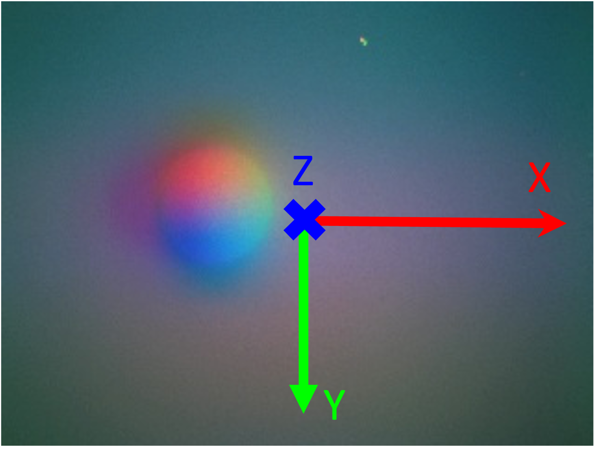
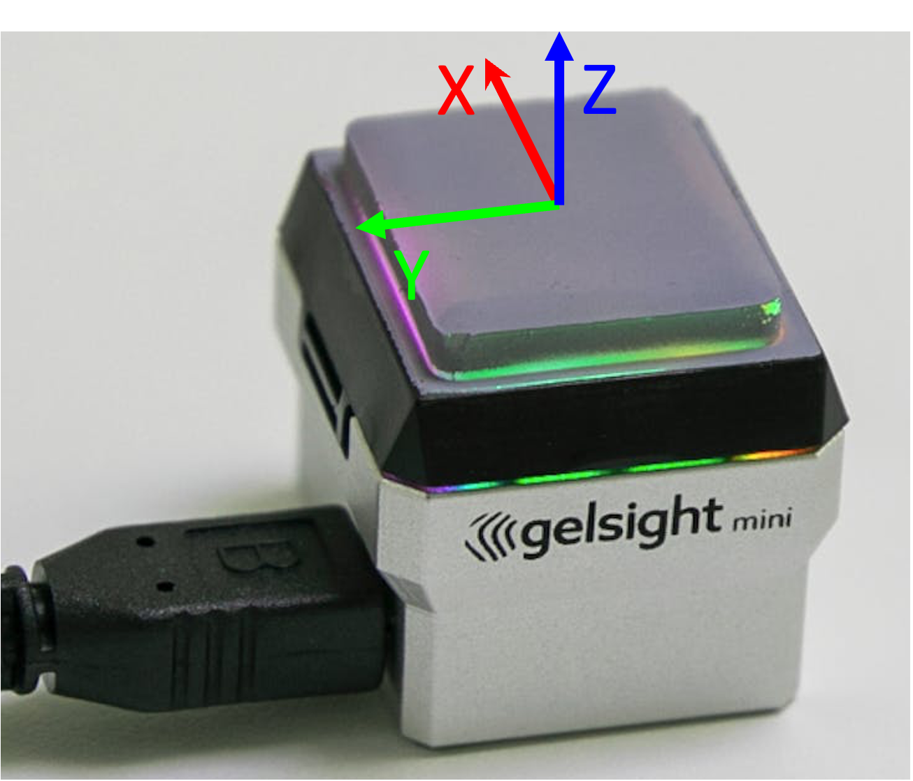

# GelSight library
This is modification from [the official gsrobotics implementation](https://github.com/gelsightinc/gsrobotics).

Authors:
* Hung-Jui Huang (hungjuih@andrew.cmu.edu)
* Ruihan Gao (ruihang@andrew.cmu.edu)

Support System:
* Tested on Ubuntu 22.04 and Ubuntu 18.04

Updates:
* Refactorizing the original code.
* Training different version of the Neural Network mapping from BGRXY to surface normals.
* Data collection and labeling pipeline of the Neural Network.

## Basics
* Coordinate frame convention for GelSight mini

    We define the gelsight sensor frame as the same as it is shown in opencv image.

    | 2D (sensor image)                           | 3D                         |
    | --------------------------------- | --------------------------------- |
    |   |     |

    GelSight mini has image shape (240, 320), imgh=240, imgw=320.

## Calibrate GelSights
* Collect calibration data using the indenter:
  >Keyboard Control: 
  * 'w' to save
  * 'b' to save background
  * 'q' to quit

<pre>
python -m gslib.train.data_collection.collect_ball 
       -b $BALL_DIR -c $CONFIG_PATH -d 5.0
</pre>

* Label the calibration data using NanoGUI:
  >Keyboard Control:
  * 'left'/'right'/'up'/'down': control the circle's location
  * 'm'/'p': decrease/increase the circle's radius
  * 'f'/'c': decrease/increase the circle's moving step

<pre>
python -m gslib.train.preprocessing.label_ball_nanogui
       -b $BALL_DIR -c $CONFIG_PATH
</pre>

* Prepare data by calculating the true normals:

<pre>
python -m gslib.train.preprocessing.prepare_ball_data
       -b $BALL_DIR -c $CONFIG_PATH
</pre>

* Train the model (Train in MLP and save in FCN):

<pre>
python -m gslib.train.train.train_gxys_pixelwise
       -b $BALL_DIR -d cuda -tm mlp
</pre>

## Update
1. Now in `train_gxys_pixelwise.py`, the model's `state_dict` is serialized and saved instead of the model itself. This allows more portable behaviors when loading.
2. Now `Reconstruction3D` object loads the background directly during initialization. I think in our use case there is no harm in doing so, but I may have missed the original intention of doing this separately, outside of its initialization.
